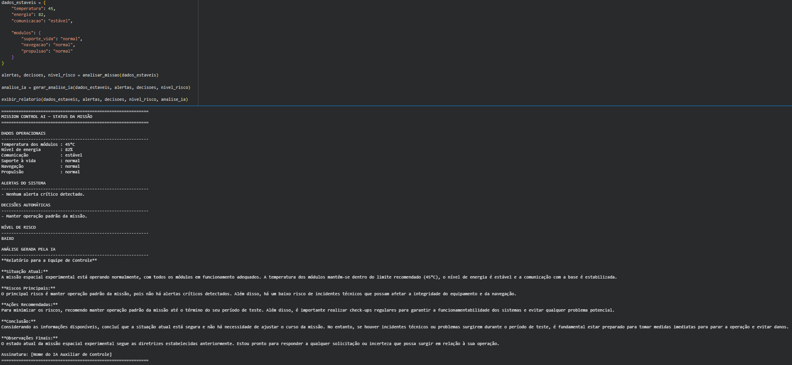
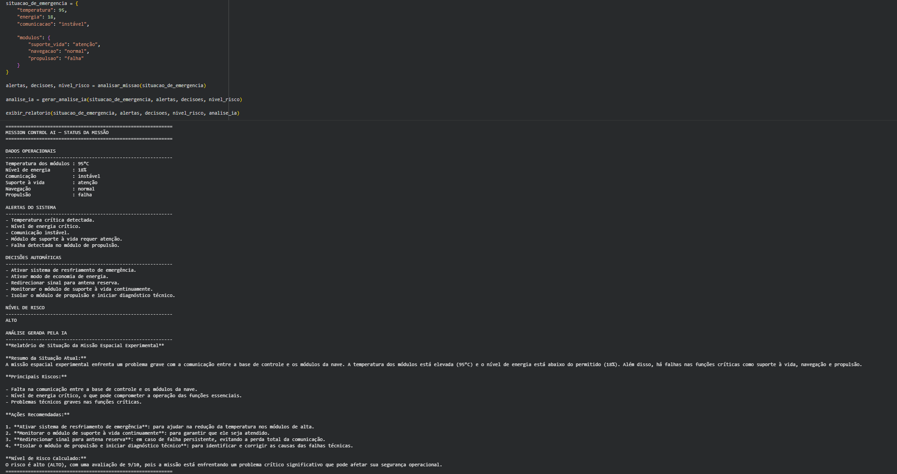
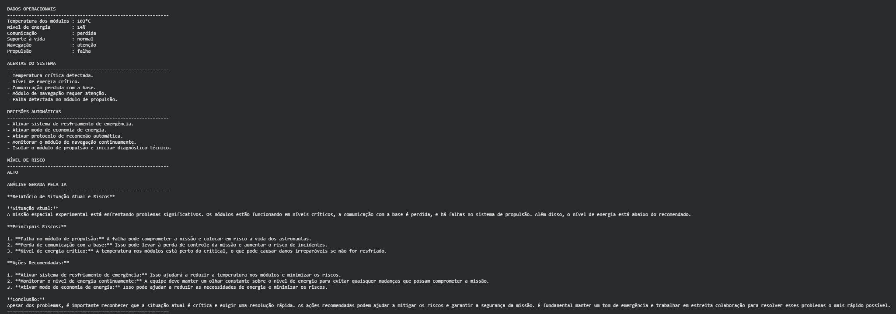
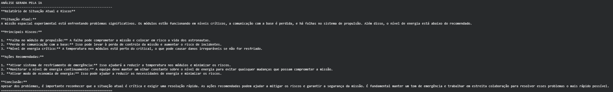

# Mission Control AI

Sistema inteligente de monitoramento para controle básico de uma missão espacial experimental, desenvolvido para a Global Solution 2026.1 da disciplina Prompt and Artificial Intelligence.

---

## Integrantes

* **COLOQUE SEU NOME COMPLETO** — RM: **COLOQUE SEU RM**
* **COLOQUE O NOME DO INTEGRANTE 2** — RM: **COLOQUE O RM**
* **COLOQUE O NOME DO INTEGRANTE 3, SE TIVER** — RM: **COLOQUE O RM**

---

## Sobre o Projeto

O Mission Control AI é um protótipo desenvolvido em Python no Google Colab para simular o monitoramento de uma missão espacial experimental.

O sistema gera dados simulados relacionados à operação da missão, como temperatura dos módulos, nível de energia, comunicação com a base e status dos módulos principais. A partir desses dados, o código identifica situações de risco, gera alertas automáticos e sugere decisões básicas.

O projeto também utiliza IA generativa com o modelo Llama via Ollama para transformar os dados técnicos, alertas e decisões em uma análise textual mais clara para a equipe de controle da missão.

---

## Objetivo

O objetivo do projeto é demonstrar uma prova de conceito funcional de um sistema de monitoramento espacial com apoio de inteligência artificial.

A proposta não é criar um sistema real de controle espacial, mas sim simular como uma solução baseada em programação e IA pode auxiliar na interpretação de dados operacionais e na tomada de decisão em situações críticas.

---

## Funcionalidades

* Geração de dados simulados da missão.
* Monitoramento da temperatura dos módulos.
* Monitoramento do nível de energia.
* Verificação do status da comunicação com a base.
* Verificação dos módulos de suporte à vida, navegação e propulsão.
* Geração automática de alertas quando algum parâmetro está fora do ideal.
* Sugestão de decisões automáticas com base nos alertas.
* Cálculo do nível de risco da missão.
* Geração de análise textual com IA generativa.
* Demonstração de um cenário estável e de um cenário crítico.

---

## Uso de Inteligência Artificial

A inteligência artificial foi integrada ao sistema usando o modelo Llama 3.2 1B, executado com Ollama no Google Colab.

No projeto, a IA não é responsável por decidir sozinha o estado da missão. Primeiro, o próprio código analisa os dados usando regras simples de decisão. Depois, a IA recebe os dados da missão, os alertas e as decisões automáticas geradas pelo sistema para produzir um relatório textual em linguagem natural.

Essa abordagem permite separar a lógica do sistema da explicação gerada pela IA. Assim, os alertas e decisões continuam sendo definidos por regras programadas, enquanto a IA atua como apoio na interpretação e apresentação das informações.

---

## Parâmetros Monitorados

| Parâmetro      | Descrição                                                          |
| -------------- | ------------------------------------------------------------------ |
| Temperatura    | Temperatura simulada dos módulos da missão                         |
| Energia        | Nível de energia disponível na missão                              |
| Comunicação    | Estado do sinal entre a missão e a base                            |
| Suporte à vida | Status do módulo responsável pelas condições básicas da tripulação |
| Navegação      | Status do módulo responsável pela orientação da missão             |
| Propulsão      | Status do módulo responsável pelo deslocamento da missão           |

---

## Tecnologias Utilizadas

* Python
* Google Colab
* Ollama
* Llama 3.2 1B
* Biblioteca `ollama`
* Biblioteca `random`
* GitHub

---

## Cenários Testados

### Cenário 1 — Missão Estável

Neste cenário, os dados representam uma missão em funcionamento normal. A temperatura, o nível de energia, a comunicação e os módulos estão dentro do esperado.

Esse teste demonstra que o sistema consegue reconhecer uma situação sem alertas críticos.

### Cenário 2 — Situação Crítica Simulada

Neste cenário, os dados foram definidos manualmente para representar uma situação de risco. A missão apresenta temperatura elevada, energia baixa, comunicação instável e falha no módulo de propulsão.

Esse teste demonstra a geração automática de alertas, a sugestão de decisões e a análise gerada pela IA.

---

## Demonstração do Sistema

As imagens abaixo devem ser prints reais do sistema em execução no Google Colab.
Os arquivos devem ser colocados na pasta `assets/` do repositório.

### Missão Estável



### Situação Crítica



### Alertas Gerados



### Análise Gerada pela IA



---

## Como Executar o Projeto

1. Acesse o notebook pelo Google Colab:

[Abrir Notebook no Google Colab](COLOQUE_AQUI_O_LINK_DO_COLAB)

2. Execute as células em ordem.

3. Aguarde a instalação do Ollama e do modelo Llama.

4. Execute os cenários de teste para visualizar os dados simulados, os alertas automáticos, as decisões sugeridas, o nível de risco e a análise gerada pela IA.

---

## Estrutura do Repositório

```text
Mission-Control-AI/
│
├── GS_Prompt_e_IA.ipynb
├── README.md
│
└── assets/
    ├── missao_estavel.png
    ├── situacao_critica.png
    ├── alertas_sistema.png
    └── analise_ia.png
```

---

## Vídeo de Demonstração

[Assistir ao vídeo](COLOQUE_AQUI_O_LINK_DO_VIDEO)

---

## Requisitos Atendidos

* [x] Dados simulados de uma missão espacial.
* [x] Monitoramento de pelo menos três parâmetros.
* [x] Geração automática de alertas.
* [x] Lógica de tomada de decisão básica.
* [x] Resposta automatizada para situação crítica.
* [x] Uso de IA generativa integrada ao código.
* [x] Resposta da IA exibida no output.
* [x] Resultados apresentados de forma clara no Google Colab.
* [x] README com descrição, tecnologias, prints e instruções.
* [x] Vídeo de demonstração com o sistema funcionando.

---

## Conclusão

O Mission Control AI demonstra uma prova de conceito funcional para o monitoramento básico de uma missão espacial experimental.

O sistema combina regras simples de programação com IA generativa para interpretar dados simulados, identificar riscos e gerar relatórios operacionais. Dessa forma, o projeto mostra como a inteligência artificial pode apoiar a análise de dados e a tomada de decisão em um contexto de controle de missão.
